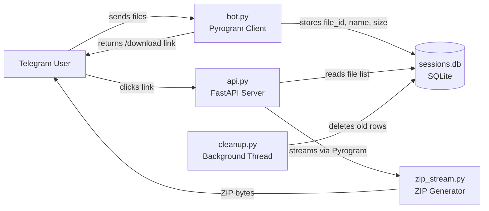

# Telegram ZIP Bot — Project Analysis

## Architecture Overview



**Two separate processes:**
| Process | Command | Role |
|---------|---------|------|
| Bot | `python app\bot.py` | Receives files from Telegram, stores metadata in SQLite |
| API | `uvicorn app.api:app` | Serves ZIP downloads by streaming files from Telegram |

---

## 🔴 Critical Issues

### 1. Hardcoded Secrets in Source Code

> [!CAUTION]
> `API_ID`, `API_HASH`, and `BOT_TOKEN` are hardcoded in **three files** ([bot.py](file:///c:/Users/abhir/Desktop/Projects/telegram_zip_bot/app/bot.py#L17-L19), [zip_stream.py](file:///c:/Users/abhir/Desktop/Projects/telegram_zip_bot/app/zip_stream.py#L8-L10)). If this repo is ever pushed to GitHub, your bot token is fully exposed and can be hijacked immediately.

**Fix:** Use environment variables or a `.env` file with `python-dotenv`.

```python
# config.py
import os
from dotenv import load_dotenv
load_dotenv()

API_ID = int(os.environ["API_ID"])
API_HASH = os.environ["API_HASH"]
BOT_TOKEN = os.environ["BOT_TOKEN"]
BASE_URL = os.environ.get("BASE_URL", "http://127.0.0.1:8000")
```

---

### 2. No Session Validation — Anyone Can Download Any Session

> [!CAUTION]
> The `/download/{session_id}` endpoint has **zero authentication**. Session IDs are UUIDs, but if anyone guesses or intercepts a link, they get the files. There's also no rate limiting, so an attacker could brute-force session IDs.

**Fix:** Add a per-session secret token, or tie downloads to the Telegram user who created the session.

---

### 3. Pyrogram Client Spin-Up Per Download

> [!WARNING]
> [zip_stream.py](file:///c:/Users/abhir/Desktop/Projects/telegram_zip_bot/app/zip_stream.py#L30-L36) creates a **brand-new Pyrogram `Client`**, connects, authenticates, downloads, then disconnects — on every single download request. This is very slow (~2-5 seconds overhead per request) and will hit Telegram rate limits under load.

**Fix:** Use a single, long-lived Pyrogram client (shared between bot and API, or a persistent one in the API process).

---

### 4. `zip_stream.py` — Loads Everything Into Memory

> [!WARNING]
> [Lines 60-67](file:///c:/Users/abhir/Desktop/Projects/telegram_zip_bot/app/zip_stream.py#L60-L67) collect **all** ZIP chunks into a list in memory before returning. This defeats the entire purpose of streaming. A user sending 500 MB of files will cause the server to hold 500 MB+ in RAM for that single request.

**Fix:** Return a true streaming generator instead of materializing all chunks.

---

## 🟡 Bugs & Functional Issues

### 5. `user_sessions` Dict Is In-Memory Only

In [bot.py line 30](file:///c:/Users/abhir/Desktop/Projects/telegram_zip_bot/app/bot.py#L30), `user_sessions = {}` lives only in the bot process memory. If the bot restarts, all in-progress sessions (users who sent files but haven't sent `/done` yet) are **silently lost**. The files are in the DB, but the user-to-session mapping is gone.

**Fix:** Store the user↔session mapping in the database.

---

### 6. Import Path Inconsistency

[bot.py line 5](file:///c:/Users/abhir/Desktop/Projects/telegram_zip_bot/app/bot.py#L5-L8) uses `from sessions import ...` (bare module), while all other files use `from app.sessions import ...`. This works only because `bot.py` is run directly (`python app\bot.py` with `app/` as the effective path), but it will break if you ever run the bot as part of the package or refactor.

---

### 7. `cleanup_sessions()` Has No Index

[sessions.py line 96-111](file:///c:/Users/abhir/Desktop/Projects/telegram_zip_bot/app/sessions.py#L96-L111) runs `DELETE FROM sessions WHERE created_at < ?` every 10 minutes. There's no index on `created_at`, so this becomes a full table scan as the database grows.

---

### 8. `requirements.txt` Is Empty

[requirements.txt](file:///c:/Users/abhir/Desktop/Projects/telegram_zip_bot/requirements.txt) is blank. Anyone cloning the project has no idea what to install.

**Should contain at minimum:**
```
pyrogram
tgcrypto
fastapi
uvicorn
zipstream-new
python-dotenv
```

---

### 9. `start_cleanup_worker()` Runs at Import Time

[api.py line 9](file:///c:/Users/abhir/Desktop/Projects/telegram_zip_bot/app/api.py#L9) calls `start_cleanup_worker()` at module level, which means every time **any** module imports `api.py` (tests, tools, etc.), a cleanup thread spawns. This should be in a FastAPI `lifespan` event.

---

### 10. No `__init__.py` in `app/`

The `app/` directory has no `__init__.py`. This works with modern Python, but adding one makes the package structure explicit and avoids import ambiguity.

---

## 🟢 Improvement Suggestions

| # | Area | Suggestion |
|---|------|-----------|
| 11 | **Error handling** | `generate_zip_stream` raises a bare `Exception`. Use custom exceptions (`SessionNotFound`, `StreamError`) and return proper HTTP 404s. |
| 12 | **Logging** | Only `bot.py` has logging. `api.py`, `zip_stream.py`, and `cleanup.py` have none — failures are invisible. |
| 13 | **Graceful shutdown** | Neither process handles `SIGINT`/`SIGTERM` gracefully. The Pyrogram client in `zip_stream.py` may not disconnect cleanly. |
| 14 | **File types** | `bot.py` only handles `filters.document`. Photos, videos, and audio sent as non-document media are silently ignored. |
| 15 | **DB connection management** | Every function in `sessions.py` opens and closes its own SQLite connection. Use a connection pool or context manager pattern. |
| 16 | **Download filename** | The ZIP is always named `files.zip`. Consider using the session ID or a user-provided name. |
| 17 | **Session lifecycle** | No feedback to the user about how many files are in their session, total size, or a way to cancel/clear. |
| 18 | **`storage/` and `logs/` dirs** | Both directories exist but are empty and unused. Either use them or remove them. |

---

## Priority Roadmap

| Priority | Items | Effort |
|----------|-------|--------|
| **P0 — Do now** | #1 (secrets), #2 (auth), #8 (requirements.txt) | ~1 hour |
| **P1 — Before any real users** | #3 (shared client), #4 (true streaming), #12 (logging) | ~3 hours |
| **P2 — Hardening** | #5 (persist sessions), #7 (DB index), #9 (lifespan), #11 (error handling) | ~2 hours |
| **P3 — Polish** | #6, #10, #13-#18 | ~2 hours |
